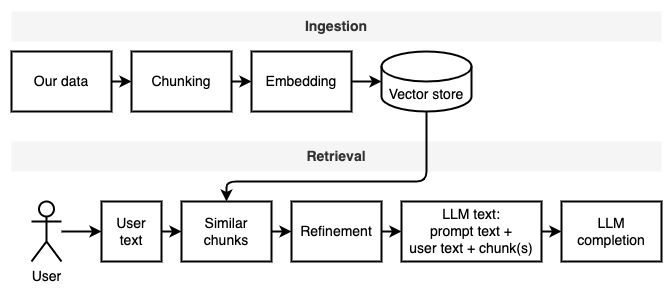

# Using LLMs on private data

This project is a learning exercise on using language models (LLMs) on private data. The goal is to use an LLM to ask questions on private data.

We can divide the project into two parts: ingesting and retrieving data.

1. Ingestion: The goal is to divide data into chunks that fit into the LLM input size. Once the information is divided into chunks, we need to find the most relevant chunks to the question. This is done with a similarity function.
1. Retrieval: Once we determined the most relevant chunks, we can use the LLM to answer the question. To do so, we combine the user question with the relevant chunks and a prompt instructing the LLM to answer the question.

These two steps are illustrated in the following diagram.



## How to use this project

If you haven't done so yet, [prepare the environment](#preparing-the-environment). If you have already prepared the environment, activate it with `source venv/bin/activate`.

1. Copy the data you want to use into the `data` folder.
1. Run `python main.py ingest` to ingest the data into the vector store.
1. Run `python main.py retrieve` to retrieve data from the vector store. It will prompt you for a question.

Use the `--verbose` flag to get more details on what the program is doing behind the scenes.

To update the data, copy the new data into the `data` folder and run `python main.py ingest` again.

## Design

### Ingesting data

The goal of this stage is to make the data searchable. However, the user's question and the data contents may not match exactly. Therefore, we cannot use a simple search engine. We need to perform a similarity search, which is supported by [vector embeddings](https://www.pinecone.io/learn/vector-embeddings/). The vector embedding is the most important part of this stage.

Ingesting data has the following steps:

1. Load the file: a document reader that matches the document type is used to load the file. At this point, we have an array of characters with the file contents (referred to as a "document" from now on). Metadata, pictures, etc., are ignored.
1. Split the document into chunks: a document splitter divides the document into chunks of the specified size. We need to split the document to fit the context size of the model (and to send fewer tokens when using a paid model). The exact size of each chunk depends on the document splitter. For example, a sentence splitter attempts to split at the sentence level, making some chunks smaller than the specified size.
1. Create [vector embeddings](https://www.pinecone.io/learn/vector-embeddings/) for each chunk: an embedding model creates a vector embedding for each chunk. This is the crucial step that allows us to find the most relevant chunks to a question.
1. Save the embeddings into the [vector database (store)](https://www.pinecone.io/learn/vector-database/): persist all the work we did above so we don't have to repeat it in the future.

Future improvements:

- [ ] Improve parallelism. Ideally, we want to run the entire workflow (load document, chunk, embed, persist) in parallel for each file. This requires a solution that parallelizes not only I/O-bound but also CPU-bound tasks. The vector store must also support multiple writers.
- [ ] Check if sentence splitters ( `NLTKTextSplitter` or `SpacyTextSplitter`) improve the answers.
- [ ] Choose chunking size based on the LLM input (context) size. It is currently hardcoded to a small number, which may affect the quality of the results. On the other hand, it saves costs on the LLM API. We need to find a balance.
- [ ] Correctly update the store when reading documents already in it. Currently, the store size grows with each run, indicating that we may be adding the same documents multiple times.
- [ ] Automate the ingestion process: detect if there are new or changed files and ingest them.

### Retrieving data

## Sources

Most of the ingest/retrieve code is based on [privateGTP](https://github.com/imartinez/privateGPT).

What is different:

- Modernized the code. For example, it uses `pathlib` instead of `os.path` and has proper logging instead of print statements.
- Added more logging to understand what is going on. Use the `--verbose` flag to see the details.
- Added a main program to run the ingest/retrieve steps.
- Filled in `requirements.txt` with the indirect dependencies, for example, for HuggingFace transformers and LangChain document loaders.

See [this file](./notes.md) for more notes collected during the development of this project.

## Preparing the environment

This is a one-time step. If you have already done this, just activate the virtual environment with `source venv/bin/activate`.

Run the following commands to create a virtual environment and install the required packages.

```bash
python3 -m venv venv
source venv/bin/activate
pip install --upgrade pip
pip install -r requirements.txt
```
