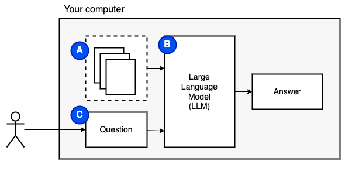

# Using LLMs on private data, all locally

This project is a learning exercise on using large language models (LLMs) to retrieve information from private data, running all pieces (including the model) locally. The goal is to run an LLM on your computer to ask questions on a set of files also on your computer. The files can be any type of document, such as PDF, Word, or text files.

This method of combining LLMs and private data is known as **retrieval-augmented generation** (RAG). It was introduced in [this paper](https://arxiv.org/abs/2005.11401).

Credit where credit is due: I based this project on [privateGPT](https://github.com/imartinez/privateGPT). I reimplemented the pieces to understand how they work. See more in the [sources](#sources) section.

What we are trying to achieve: given a set of files on a computer (A), we want a large language model (B) running on that computer to answer questions (C) on them.



However, we cannot feed the files directly to the model. Large language models (LLMs) have a context window that limits how much information we can feed into them (their working memory). To overcome that limitation, we split the files into smaller pieces, called _chunks_, and feed only the relevant ones to the model (D).


But then, the question becomes _"how do we find the relevant chunks?"_. We use [similarity search](https://www.pinecone.io/learn/what-is-similarity-search/) (E) to match the question and the chunks. Similarity search, in turn, requires [vector embeddings](https://www.pinecone.io/learn/vector-embeddings/) (F), a representation of words with vectors that encode semantic relationships (technically, a _dense_ vector embedding, not to confuse it with sparse vector representations such as [bag-of-words](https://en.wikipedia.org/wiki/Bag-of-words_model) and [TF-IDF](https://en.wikipedia.org/wiki/Tf%E2%80%93idf)). Once we have the relevant chunks, we combine them with the question to create a prompt (G) that instructs the LLM to answer the question.


We need one last piece: persistent storage. Creating embeddings for the chunks takes time. We don't want to do that every time we ask a question. Therefore, we need to save the embeddings and the original text (the chunks) in a [vector store (or database)](https://www.pinecone.io/learn/vector-database/) (H). The vector store can grow large because it stores the original text chunks and their vector embeddings. We use a [vector index](https://www.pinecone.io/learn/vector-indexes/) (I) to find relevant chunks efficiently.


Now we have all the pieces we need.

We can divide the implementation into two parts: ingesting and retrieving data.

1. Ingestion: The goal is to divide the local files into smaller chunks that fit into the LLM input size (context window). We also need to create [vector embeddings](https://www.pinecone.io/learn/vector-embeddings/) for each chunk. The vector embeddings allow us to find the most relevant chunks to help answer the question. Because chunking and embedding take time, we want to do that only once, so we save the results in a [vector store](https://www.pinecone.io/learn/vector-database/) (database).
2. Retrieval: Given a user question, we use [similarity search](https://www.pinecone.io/learn/what-is-similarity-search/) to find the most relevant chunks (i.e. the pieces of the local files related to the question). Once we determine the most relevant chunks, we can use the LLM to answer the question. To do so, we combine the user question with the relevant chunks and a prompt instructing the LLM to answer the question.

These two steps are illustrated in the following diagram.


## How to use this project

If you haven't done so yet, [prepare the environment](#preparing-the-environment). If you have already prepared the environment, activate it with `source venv/bin/activate`.

There are two ways to use this project:

1. [Command line interface](#command-line-interface)
1. [Streamlit app (somewhat experimental)](#streamlit-app)

### Command-line interface

1. Copy the files you want to use into the `data` folder.
1. Run `python main.py ingest` to ingest the files into the vector store.
1. Run `python main.py retrieve` to retrieve data from the vector store. It will prompt you for a question.

Use the `--verbose` flag to get more details on what the program is doing behind the scenes.

To update the data, copy the new data into the `data` folder and run `python main.py ingest` again.

### Streamlit app

Run `streamlit run app.py`. It will open the app in a browser window.

## Design

### Ingesting data

If you haven't done so yet, [prepare the environment](#preparing-the-environment). If you have already prepared the environment, activate it with `source venv/bin/activate`.

Command: `python main.py ingest [--verbose]`

The goal of this stage is to make the data searchable. However, the user's question and the data contents may not match exactly. Therefore, we cannot use a simple search engine. We need to perform a similarity search supported by [vector embeddings](https://www.pinecone.io/learn/vector-embeddings/). The vector embedding is the most important part of this stage.

Ingesting data has the following steps:

1. Load the file: a document reader that matches the document type is used to load the file. At this point, we have an array of characters with the file contents (a "document" from now on). Metadata, pictures, etc., are ignored.
1. Split the document into chunks: a document splitter divides the document into chunks of the specified size. We need to split the document to fit the context size of the model (and to send fewer tokens when using a paid model). The exact size of each chunk depends on the document splitter. For example, a sentence splitter attempts to split at the sentence level, making some chunks smaller than the specified size.
1. Create [vector embeddings](https://www.pinecone.io/learn/vector-embeddings/) for each chunk: an embedding model creates a vector embedding for each chunk. This is the crucial step that allows us to find the most relevant chunks to help answer the question.
1. Save the embeddings into the [vector database (store)](https://www.pinecone.io/learn/vector-database/): persist all the work we did above so we don't have to repeat it in the future.

Future improvements:

- [ ] More intelligent document parsing. For example, do not mix figure captions with the section text; do not parse the reference section (alternatively, replace the inline references with the actual reference text).
- [ ] Improve parallelism. Ideally, we want to run the entire workflow (load document, chunk, embed, persist) in parallel for each file. This requires a solution that parallelizes not only I/O-bound but also CPU-bound tasks. The vector store must also support multiple writers.
- [ ] Try different [chunking strategies](https://www.pinecone.io/learn/chunking-strategies/), e.g. check if sentence splitters ( `NLTKTextSplitter` or `SpacyTextSplitter`) improve the answers.
- [ ] Choose chunking size based on the LLM input (context) size. It is currently hardcoded to a small number, which may affect the quality of the results. On the other hand, it saves costs on the LLM API. We need to find a balance.
- [ ] Correctly update the store when reading documents already in it. Currently, the store size grows with each run, indicating that we may be adding the same documents multiple times.
- [ ] Automate the ingestion process: detect if there are new or changed files and ingest them.

### Retrieving data

If you haven't done so yet, [prepare the environment](#preparing-the-environment). If you have already prepared the environment, activate it with `source venv/bin/activate`.

Command: `python main.py retrieve [--verbose]`

The goal of this stage is to retrieve information from the local data. We do that by fetching the most relevant chunks from the vector store and combining them with the user's question and a prompt. The prompt instructs the language model (LLM) to answer the question.

Retrieving data has the following steps:

1. Find the most relevant chunks: the vector store is queried to find the most relevant chunks to the question.
1. Combine the chunks with the question and a prompt: the chunks are combined with the question and a prompt. The prompt instructs the LLM to answer the question.
1. Send the combined text to the LLM: the combined text is sent to the LLM to get the answer.

Future improvements:

- [ ] Add [LangChain callbacks](https://python.langchain.com/en/latest/modules/callbacks/getting_started.html) to view the steps of the retrieval process.
- [ ] Try larger context windows.
- [ ] Improve the prompt to answer only with what is in the local documents, e.g. "Use only information from the following documents: ...". Without this step the model seems to dream up an answer from the training data, which is not always relevant.
- [ ] Add [moderation](https://github.com/hwchase17/langchain/blob/7047a2c1afce1f1e2e6e4e3e9d94bbf369466a5f/docs/modules/chains/examples/moderation.ipynb) to filter out offensive answers.
- [ ] Improve the answers with [reranking](https://github.com/openai/openai-cookbook/blob/2a2753e8d0566fbf21a8270ce6afaf761d7cdee5/apps/enterprise-knowledge-retrieval/enterprise_knowledge_retrieval.ipynb#L1388): _"over-fetch our search results, and then deterministically rerank based on a modifier or set of modifiers."_.
- [ ] Try different [chain types](https://python.langchain.com/en/latest/modules/chains/index_examples/vector_db_qa.html#chain-type) (related to the previous point).

## Improving results

We had to make some compromises to make it run on a local machine in a reasonable amount of time.

- We use a small model. This one is hard to change. The model has to run on a CPU and fit in memory.
- We use a small context window. We can increase the context window if we wait longer for the results from the model.
- We use a small embedding size. We can increase the embedding size if we wait longer for the ingestion process.
- Keep everything the same and try different [chains](https://python.langchain.com/en/latest/modules/chains/index_examples/qa_with_sources.html).

## Sources

Most of the ingest/retrieve code is based on [privateGPT](https://github.com/imartinez/privateGPT).

What is different:

- Streamlit app for the UI.
- Modernized the code. For example, it uses `pathlib` instead of `os.path` and has proper logging instead of print statements.
- Added more logging to understand what is going on. Use the `--verbose` flag to see the details.
- Added a main program to run the ingest/retrieve steps.
- Filled in `requirements.txt` with the indirect dependencies, for example, for HuggingFace transformers and LangChain document loaders.

See [this file](./notes.md) for more notes collected during the development of this project.

## Preparing the environment

This is a one-time step. If you have already done this, just activate the virtual environment with `source venv/bin/activate`.

### Python environment

Run the following commands to create a virtual environment and install the required packages.

```bash
python3 -m venv venv
source venv/bin/activate
pip install --upgrade pip
pip install -r requirements.txt
```

### Model

I suggest starting with the model recommended by [privateGPT](https://github.com/imartinez/privateGPT), _GPT4All-J v1.3-groovy_. This model offers reasonable performance and runs on a CPU using about 4 GB of RAM. See the [GPT4All website](https://gpt4all.io/index.html) for a list of GPT4All models and their comparison. Note that some of the models have restrictive licenses. Check the license before using them in commercial projects.

1. Create a folder named `models`.
1. Click [here to download GPT4All-J v1.3-groovy](https://gpt4all.io/models/ggml-gpt4all-j-v1.3-groovy.bin) (3.5 GB).
1. Copy the model to the `models` folder.